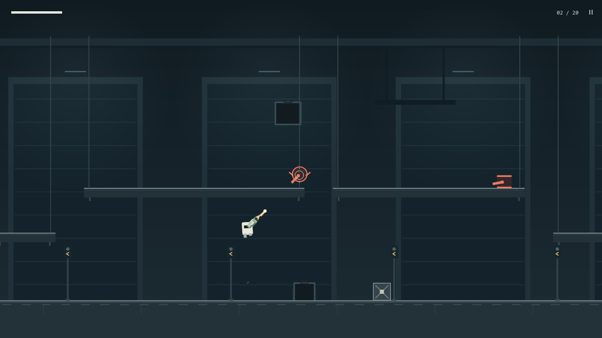

# Recoil Foundry

**One gun. All recoil.**

[Play free on itch.io](https://caleb-guyer.itch.io/recoil-foundry) · [GitHub mirror](https://caleb-guyer.github.io/recoil-foundry/) · [Watch gameplay](https://caleb-guyer.github.io/recoil-foundry/media/gameplay.mp4)

A physics roguelike set inside a hostile factory. Build one gun between fights, use its kick to throw yourself through the air, and survive twenty rooms across five areas. Shoot down. Go up.



- **105 upgrades** with branching paths and combinations that change how your gun works.
- Shifting room layouts, physical obstacles, optional fights and surprises worth finding yourself.
- A **Daily Run** with the same seed and fixed upgrade choices for everyone.
- A Logbook to uncover, unlocked boss Practice, a Workshop for builds, and death replays.
- An original procedural soundtrack and separate music/effects controls.

**Dead Signal — version 3.0.3.** Take the alternate Transmission Annex route after Furnace, interrupt hostile transmissions, and reboot fallen machines with five Subversion upgrades. The latest patch lets you bring discovered Workshop upgrades into unlocked boss Practice and fixes importing Annex progress backups. [Release notes](docs/releases/3.0.3.md) · [Watch the update trailer](https://caleb-guyer.github.io/recoil-foundry/media/dead-signal.mp4) · [Download the static site](https://github.com/Caleb-Guyer/recoil-foundry/releases/tag/v3.0.3).

## Controls

| Input                        | Action                     |
| ---------------------------- | -------------------------- |
| A / D or left / right arrows | Move                       |
| Space / W / up arrow         | Jump; hold for more height |
| Mouse                        | Aim                        |
| Left click or F              | Fire                       |
| Right click or E             | Equipped secondary action  |
| Escape / P                   | Pause                      |
| H                            | Controls                   |
| 1–3 at a reward              | Choose an upgrade          |

Shooting downward while airborne lifts you up. Shooting sideways pushes you the other way. **Controls → Try controls** gives you a safe place to learn. Rebind keys in **Settings → Keyboard & mouse**.

## Saves, settings and help

Progress stays in this browser on this device. **Settings → Progress** exports a backup or restores one. Moving to another browser or between itch.io and the GitHub mirror does not move your save automatically; export from the old location, then import at the new one.

If the game is silent, check **Sound**, **Music enabled**, and both volume sliders in Settings. **Reduced effects** lowers shake, flashes and particles while keeping attack warnings visible.

The supported target is **Windows desktop/laptop with keyboard and mouse**. Edge has the most complete verification; basic gameplay is also owner-confirmed in Chrome and Firefox. Controller and touch are experimental. Minimum hardware requirements are not established. [Support and known limitations](docs/browser-support.md).

Choose **Feedback** after a run, or **Settings or Pause → Report an issue**, to share a bug, difficulty feedback or a suggestion. Review the editable run details, then open a GitHub draft or copy the text. Nothing is submitted automatically; posting on GitHub requires an account. You can also [report a bug directly](https://github.com/Caleb-Guyer/recoil-foundry/issues/new?template=bug_report.md). Please describe what happened and how to repeat it; a screenshot or replay can help.

## Development

Use Node.js 24, then:

```sh
npm ci
npm run dev
```

`npm test` runs the automated checks. `npm run build` creates the static site in `dist/`. Pushing `main` runs tests, builds and deploys to GitHub Pages.

[Release completion](docs/browser-release-checklist.md) · [Media kit](docs/release-media.md) · [itch.io launch](docs/itch-io/README.md) · [Development history](docs/development-history.md)

A game by Caleb Guyer. Built with TypeScript, Vite and Matter.js. [MIT license](LICENSE) · [Third-party notices](public/third-party-notices.txt).
