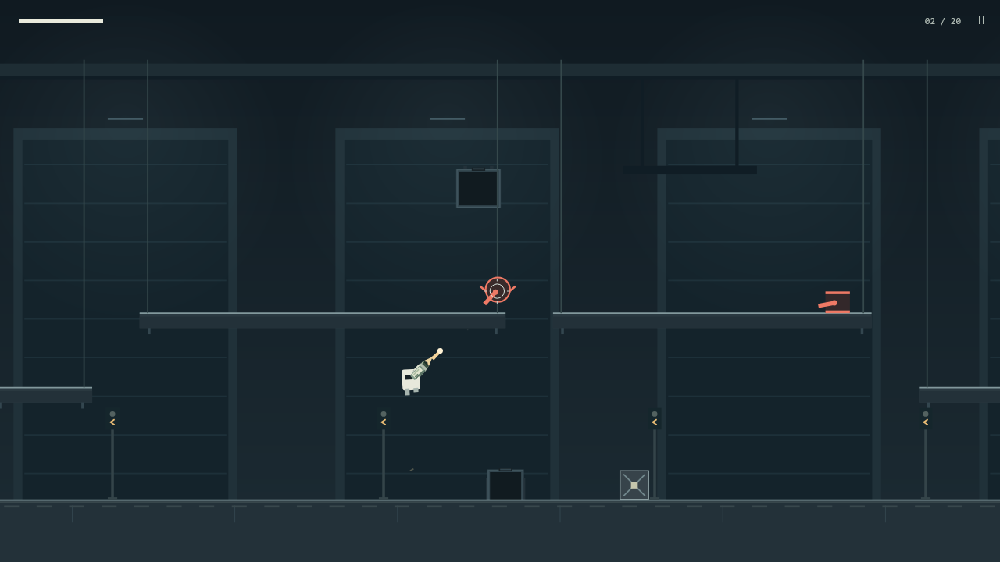

# Recoil Foundry

**One gun. All recoil.**

[Play free on itch.io](https://caleb-guyer.itch.io/recoil-foundry) · [GitHub mirror](https://caleb-guyer.github.io/recoil-foundry/) · [Watch gameplay](https://caleb-guyer.github.io/recoil-foundry/media/gameplay.mp4)

A physics roguelike set inside a hostile factory. Build one gun between fights, use its kick to throw yourself through the air, and survive twenty rooms across five areas. Shoot down. Go up.



- **113 upgrades** with branching paths and combinations that change how your gun works.
- **Three starting guns:** begin with the pistol; earn the shotgun by clearing the Campaign and the nailgun by completing Overtime.
- Shifting room layouts, physical obstacles, optional fights and surprises worth finding yourself.
- **Factory Uprising:** choose eleven jobs across four campaign forks, visit Railworks and Foundry Core, and shape the final defense.
- A **Daily Run** with the same seed and fixed upgrade choices for everyone.
- A Logbook to uncover, unlocked boss Practice, a Workshop for builds, and death replays.
- An original procedural soundtrack and separate music/effects controls.

**See the Difference — version 4.5.0.** Hover or focus an upgrade to compare your current gun with the combined build in a real firing range. Changed values show the tradeoffs, and combination hints use upgrades you already own. Reforge comparisons include the fitting you give up. Reduced effects uses a still preview. [Release notes](docs/releases/4.5.0.md).

**Room to Move — version 4.4.0.** Campaign fights alternate between ambushes, crossfire and elevated encounters, with quieter patrols after bosses. Reinforcements enter in staggered groups, and ordinary attack warnings leave more space to move. Defense jobs separate patrol clearance from the generator hold; boss recovery leaves time for each starting gun’s firing cycle. [Release notes](docs/releases/4.4.0.md).

**Starting Guns — version 4.1.0.** Choose your tool when you start a Campaign: the Service pistol for balanced aim and recoil, the Recoil shotgun for close fights and strong launches, or the Burst nailgun for precise bursts with smaller kicks. All three use the same upgrades. Continue, Retry, replays and Workshop blueprints keep your choice; each new Daily fixes one gun for everyone. Older Continue saves and Daily links keep the pistol. [Release notes](docs/releases/4.1.0.md).

**Power and projectile lighting — version 4.0.3.** The first room stays free of Factory events, including in older Continue saves. Blackout fuse boxes are solid cabinets placed clear of machinery and coolant; shooting disables their circuit, restores the lights and leaves the inert housing in place. Bullets, shells, ice, electricity, molten rounds and beams cast light matching their ammunition. [Release notes](docs/releases/4.0.3.md).

**Factory Uprising — version 4.0.2.** Jobs begin in the second zone: new Campaign runs branch into recovery, sabotage, defense and evacuation jobs after rooms 5, 9, 13 and 17. Each job has its own layout, objective placement and firing lanes. Train and rooftop evacuations require opening two elevated route switches and boarding a marked platform within forty seconds. The compact job screen keeps campaign progress expandable. Successful jobs bring pursuit crews, shut down machinery or add crew barricades; your choices shape four possible final defenses. Campaign contracts unlock three additional jobs. Check **Pause → Factory routes** and **Logbook → Records** for your route and contract progress. The campaign remains twenty rooms. Old Continue saves, Daily, Practice and Workshop keep their rules. [Release notes](docs/releases/4.0.2.md).

**Security Levels** unlock after your first victory: coordinated elite squads, warned boss counterattacks, then machinery checkpoints across the full campaign. Each clearance unlocks the next level, with separate best times and a Redline outfit reward; Overtime remains available.

The **Sorting Pit** is a rare Reclamation fight beneath a scrap magnet. Cover rises, warning shadows appear, and the load falls on anything underneath. Shoot the exposed coil to drop it early. Three layouts include sheltered decks, inward conveyors and a recessed sorting floor.

The **Dead Signal** update also includes the alternate Transmission Annex route, five Subversion upgrades and new factory records. Save build blueprints, track Practice bests, and challenge friends to the same arena and gun. [Watch the Dead Signal trailer](https://caleb-guyer.github.io/recoil-foundry/media/dead-signal.mp4).

**Factory Shifts — version 3.18.0.** Fresh normal runs start under Freight surge, Power failure or Faction conflict. Room two introduces moving loads, power restoration or a small crew battle; the condition returns in Furnace, with ordinary rooms between encounters. Random restarts change condition, and the first two reward screens offer a distinct shooting or movement mechanic alongside the existing power safeguard. Continue preserves the chosen plan. Daily, Practice, Workshop and existing saves keep their rules. [Release notes](docs/releases/3.18.0.md).

**Foundry Archive — version 3.19.0.** Explore a Logbook grid of equipment, machines, variants, sites, documents and commendations. New discoveries have individual unread badges; open an entry to acknowledge it. Undiscovered entries keep their names and records concealed. Encountering an offered upgrade reveals its records, while collecting it unlocks Workshop ownership. [Release notes](docs/releases/3.19.0.md).

## Controls

| Input                        | Action                     |
| ---------------------------- | -------------------------- |
| A / D or left / right arrows | Move                       |
| Space / W / up arrow         | Jump; hold for more height |
| Mouse                        | Aim                        |
| Left click or F              | Fire                       |
| Right click or E             | Equipped secondary action  |
| Escape / P                   | Pause                      |
| H                            | Controls                   |
| 1–3 at a reward              | Choose a route or upgrade  |

Shooting downward while airborne lifts you up. Shooting sideways pushes you the other way. **Controls → Try controls** gives you a safe place to learn. Rebind keys in **Settings → Keyboard & mouse**.

## Saves, settings and help

Progress stays in this browser on this device. **Settings → Progress** exports a backup or restores one. Moving to another browser or between itch.io and the GitHub mirror does not move your save automatically; export from the old location, then import at the new one.

If the game is silent, check **Sound**, **Music enabled**, and both volume sliders in Settings. **Reduced effects** lowers shake, flashes and particles while keeping attack warnings visible.

The supported target is **Windows desktop/laptop with keyboard and mouse**. Edge has the most complete verification; basic gameplay is also owner-confirmed in Chrome and Firefox. Controller and touch are experimental. Minimum hardware requirements are not established. [Support and known limitations](docs/browser-support.md).

Choose **Feedback** after a run, or **Settings or Pause → Report an issue**, to share a bug, difficulty feedback or a suggestion. Review the editable run details, then open a GitHub draft or copy the text. Nothing is submitted automatically; posting on GitHub requires an account. You can also [report a bug directly](https://github.com/Caleb-Guyer/recoil-foundry/issues/new?template=bug_report.md). Please describe what happened and how to repeat it; a screenshot or replay can help.

## Development

Use Node.js 24, then:

```sh
npm ci
npm run dev
```

`npm test` runs the automated checks. `npm run build` creates the static site in `dist/`. Pushing `main` runs the regular suite alongside eight groups of maximal-build simulations; every group must pass before building and deploying to GitHub Pages. [CI commands and coverage](docs/ci.md).

[Release completion](docs/browser-release-checklist.md) · [Media kit](docs/release-media.md) · [itch.io launch](docs/itch-io/README.md) · [Development history](docs/development-history.md)

A game by Caleb Guyer. Built with TypeScript, Vite and Matter.js. [MIT license](LICENSE) · [Third-party notices](public/third-party-notices.txt).
